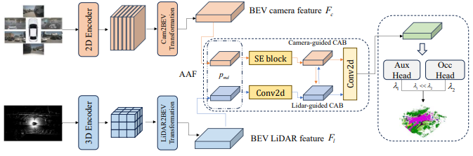
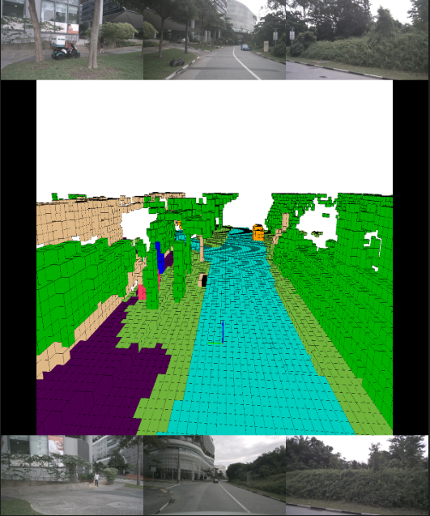

# MAAFOcc
MAAFOcc: Multimodal Adaptive Asymmetric Fusion Based Occupancy Prediction

## Highlights
1. Proposes MAAFOcc, an adaptive asymmetric fusion mechanism for occupancy prediction.
2. Introduces bidirectional channel-level attention for spatial feature alignment.
3. Imbalanced collaborative training enhances model accuracy.
4. State-of-the-art results achieved on multiple public datasets.

## Experimental results

### 3D Semantic Occupancy Prediction on [Occ3D-nuScenes](https://github.com/Tsinghua-MARS-Lab/Occ3D)

| Method | Modality | Image   Backbone | Image   Resolution | mIoU  |
|:------:|:--------------------:|:--------------------:|:----------------------:|:-----:|
| HyDra  | C+R |        R50          |        256×704         | 44.40 |
| EFFOcc  | C+L|        Swin-B          |        512×1408        | 52.62 |
| DAOcc  |  C+L|       R50          |        256×704         | 53.82 |
| MAAFOcc (ours) | C+L |         R50          |        256×704         | 54.69 |

### 3D Semantic Occupancy Prediction on [SurroundOcc](https://github.com/weiyithu/SurroundOcc)

| Method | Modality | Image   Backbone | Image   Resolution | IoU  | mIoU |
|:------:|:--------------------:|:--------------------:|:----------------------:|:----:|:----:|
| Co-Occ | C+L |        R101          |        896×1600         | 41.1 | 27.1 | 
| OccFusion | C+L+R |        R101-DCN          |        900×1600         | 44.7 | 27.3 | 
| DAOcc | C+L |        R50          |        256×704         | 45.0 | 30.5 | 
| MAAFOcc (ours) | C+L |         R50          |        256×704         | 46.4 | 31.0 | 

## Visualization

