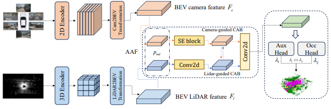
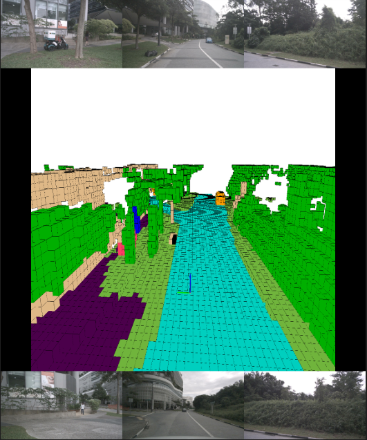

# MAAFOcc
MAAFOcc: Multimodal Adaptive Asymmetric Fusion Based Occupancy Prediction



## Highlights
1. Proposes AAF, an adaptive asymmetric fusion mechanism for occupancy prediction.
2. Introduces bidirectional channel-level attention for spatial feature alignment.
3. Imbalanced collaborative training enhances model accuracy.
4. State-of-the-art results achieved on multiple public datasets.


## Experimental results

### 3D Semantic Occupancy Prediction on [Occ3D-nuScenes](https://github.com/Tsinghua-MARS-Lab/Occ3D)

| Method | Modality | Image <br/> Backbone | Image <br/> Resolution | mIoU  |
|:------:|:--------------------:|:--------------------:|:----------------------:|:-----:|
| HyDra  | C+R |        R50          |        256×704         | 44.40 |
| EFFOcc  | C+L|        Swin-B          |        512×1408        | 52.62 |
| DAOcc  |  C+L|       R50          |        256×704         | 53.82 |
| MAAFOcc (ours) | C+L |         R50          |        256×704         | 54.69 |
| MAAFOcc-BSA | C+L |         R50          |        256×704         | 55.31 |

### 3D Semantic Occupancy Prediction on [SurroundOcc](https://github.com/weiyithu/SurroundOcc)

| Method | Modality | Image <br/> Backbone | Image <br/> Resolution | IoU  | mIoU |
|:------:|:--------------------:|:--------------------:|:----------------------:|:----:|:----:|
| Co-Occ | C+L |        R101          |        896×1600         | 41.1 | 27.1 | 
| OccFusion | C+L+R |        R101-DCN          |        900×1600         | 44.7 | 27.3 | 
| DAOcc | C+L |        R50          |        256×704         | 45.0 | 30.5 | 
| MAAFOcc (ours) | C+L |         R50          |        256×704         | 46.4 | 31.0 | 


## Visualization


## Train and Test
This work follows the training and testing pipeline of [DAOcc](https://github.com/AlphaPlusTT/DAOcc). To reproduce the performance reported in the paper, you first need to follow the DAOcc installation to set up the dependencies, and then replace the model modules in mmdet3d.

**Prerequisites**

Download the pre-trained weight of the image backbone R50 from [mmdetection3d](https://github.com/open-mmlab/mmdetection3d/tree/1.0/configs/nuimages), 
and subsequently remap the keys within the weight. Alternatively, you can directly download the processed weight file [htc_r50_backbone.pth](https://drive.google.com/file/d/19S91tPjfM2laHKipL7QDs5-6m9pQxQGz/view?usp=drive_link).

**Training**

Train MAAFOcc with 8 RTX3090 GPUs:
```shell
bash tools/dist_train.sh PATH_TO_CONFIG 8 --run-dir CHECKPOINT_SAVE_DIR --model.encoders.camera.backbone.init_cfg.checkpoint PATH_TO_PRETRAIN
```
or (deprecated)
```shell
torchpack dist-run -np 8 python tools/train.py PATH_TO_CONFIG --run-dir CHECKPOINT_SAVE_DIR --dist --model.encoders.camera.backbone.init_cfg.checkpoint PATH_TO_PRETRAIN
```

Train MAAFOcc with single GPU:
```shell
python tools/train.py PATH_TO_CONFIG --run-dir CHECKPOINT_SAVE_DIR --model.encoders.camera.backbone.init_cfg.checkpoint PATH_TO_PRETRAIN
```

**Evaluation**

Evaluate MAAFOcc with 8 RTX3090 GPUs:
```shell
bash tools/dist_test.sh PATH_TO_CONFIG PATH_TO_WEIGHT 8
```
or (deprecated)
```shell
torchpack dist-run -np 8 python tools/test.py PATH_TO_CONFIG PATH_TO_WEIGHT --dist
```

Evaluate MAAFOcc with single GPU:
```shell
python tools/test.py PATH_TO_CONFIG PATH_TO_WEIGHT

